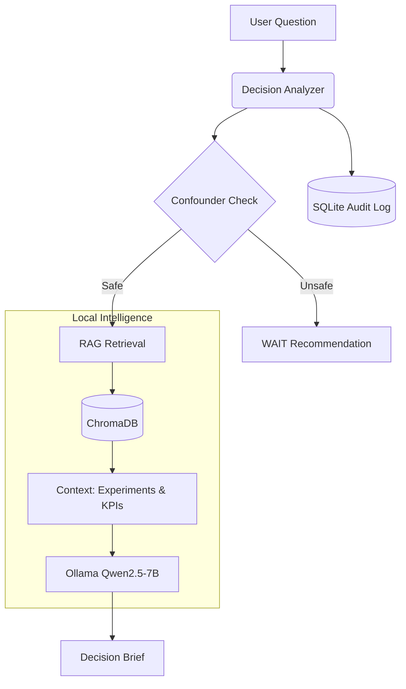

<div align="center">

# 🧠 Causal-Decision-API

### **Local-First Causal Intelligence for Business Decisions**
*Prevent correlation-based mistakes with causality-aware AI.*

[](https://fastapi.tiangolo.com)
[](https://ollama.com)
[](https://www.trychroma.com)
[](https://python.org)

<p align="center">
  <a href="#-core-features">Features</a> •
  <a href="#-architecture">Architecture</a> •
  <a href="#-quick-start">Quick Start</a> •
  <a href="#-how-it-works">How It Works</a>
</p>

</div>

---

## ⚡ Core Features

- **🔍 Causal Confounder Detection**: Automatically detects if recent company changes (e.g., *Pricing Change 3 days ago*) make your decision unsafe.
- **🏠 100% Local & Private**: Runs entirely on your machine using **Ollama (Qwen2.5-7B)** and **ChromaDB**. No data leaves your network.
- **📚 RAG-Augmented Analysis**: Retrieves context from past experiments and team KPIs to support every recommendation.
- **🛡️ Cross-Functional Safety**: Checks how your decision impacts other teams (Growth, Product, Finance, Support).

---

## 🚀 Live Simulation 
Explore the Causeway workflow and UI architecture through our interactive synthetic simulation:

👉 **[Launch Causeway Simulation](https://cause-way.vercel.app/)**

---
## 🏗 Architecture

The system follows a privacy-first, retrieval-augmented generation (RAG) architecture:



---

## 🚀 Quick Start

### Prerequisites
- **Python 3.10+**
- **[Ollama](https://ollama.com)** installed

### 1. Model Setup
Download the causal reasoning model (4.7GB):
```bash
ollama pull qwen2.5:7b
```

### 2. Installation (One-Click)
Clone the repo and run the setup script. It creates the environment and ingests simulation data automatically.
```bash
git clone https://github.com/Abishai95141/Cause-Way.git
cd Cause-Way/causal-decision-api

# Run setup script
bash setup.sh
```

### 3. Usage
Start the server:
```bash
source venv/bin/activate
uvicorn app.main:app --reload
```

ASK a decision question:
```bash
curl -X POST http://localhost:8000/api/analyze \
  -H "Content-Type: application/json" \
  -d '{"question": "Should we reduce trial duration from 14 to 7 days?"}'
```

---

## 🧠 How It Works

### The verify-first Workflow
Unlike standard LLMs that just "answer," this API follows a strict causal verification process:

1.  **Ingest Context**: It loads your company's `past_experiments.md` and `company_changes.json`.
2.  **Semantic Search**: When you ask a question, it finds relevant past failures or successes.
3.  **Confounder Window**: It checks a **14-day rolling window** for interfering events (e.g., Marketing Campaigns, Pricing Updates).
4.  **Safety Check**:
    *   **🔴 Unsafe**: If a confounder is found (e.g., "Pricing changed 3 days ago"), it forces a **WAIT** recommendation.
    *   **🟢 Safe**: If clear, it uses the LLM to draft a strategic decision brief.

---

## 📂 Project Structure

| Path | Description |
| :--- | :--- |
| `app/services/` | Core logic for LLM, RAG, and Confounder detection |
| `data/documents/` | Source of truth: Changes, Experiments, KPIs |
| `scripts/` | `ingest_documents.py` (Rebuilds vector store) |
| `database/` | `decisions.db` (Auto-created audit logs) |
| `setup.sh` | **Start here** - Full environment bootstrapper |

---

<div align="center">

**Built with ❤️ for Local-First AI**

</div>
